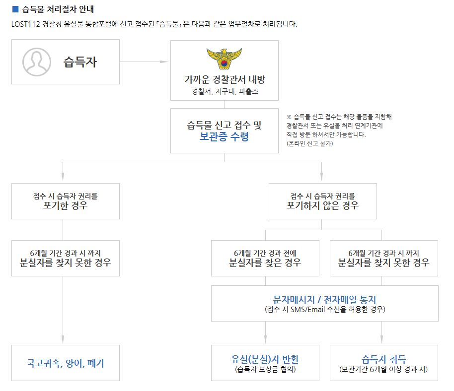
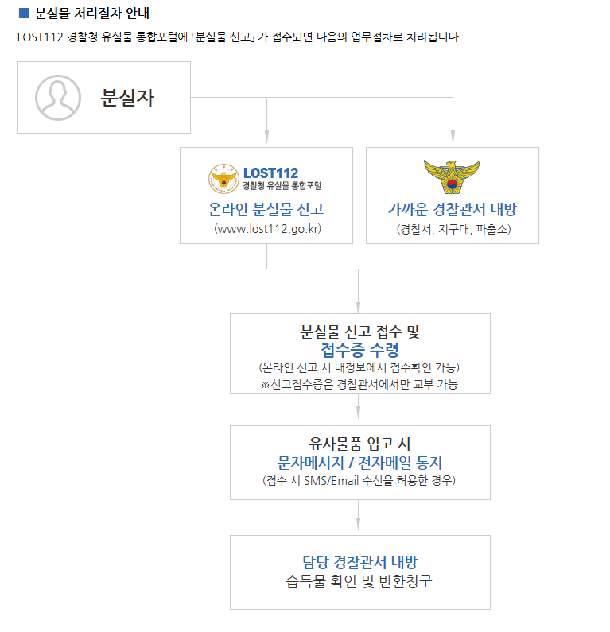

#  Campus Lost & Found (캠퍼스 분실물 찾기 서비스)

> **"학교 안에서 잃어버린 물건, 경찰서까지 가지 말고 여기서 바로 찾자!"**
> 복잡한 절차 없이 학우들과 직접 소통하며 빠르게 물건을 주고받을 수 있는 캠퍼스 전용 분실물 플랫폼입니다.


## 🗣️ 기획 배경 (Motivation)

**"에어팟 4를 주웠는데, 주인에게 돌려주는 게 왜 이렇게 힘들까?"**

얼마 전 교내 근처에서 누군가 잃어버린 에어팟 4를 습득한 경험이 있습니다. 주인을 찾아주기 위해 경찰청 유실물 종합관리시스템(LOST112)을 이용하려 했으나, 생각보다 절차가 복잡하고 불편했습니다.

1.  **복잡한 절차:** 이용을 위해서는 별도의 회원가입과 본인인증 등 번거로운 과정이 필요했습니다.
2.  **습득물 게시 불가:** 분실물 신고는 가능하지만, 습득물은 온라인으로 바로 게시할 수 없고 **반드시 경찰서나 파출소에 직접 방문해서 제출**해야만 하는 시스템이었습니다.
3.  **직접 연락 불가:** 운 좋게 주인이 쓴 분실물 게시글을 발견했지만, 개인정보 보호 등의 이유로 습득자가 주인에게 **직접 연락할 방법이 없었습니다.**
  
결국 저는 시간을 따로 내어 파출소까지 찾아가 물건을 맡겨야 했습니다. **"같은 캠퍼스 안에 있는 사람끼리라면, 굳이 경찰서를 거치지 않고 직접 연락해서 바로 돌려줄 수 없을까?"** 라는 생각에서 이 프로젝트를 시작하게 되었습니다.

## 📖 프로젝트 소개 (Overview)

**Campus Lost & Found**는 대학 캠퍼스라는 한정된 공간의 특성을 살려, 분실자와 습득자가 **가장 빠르고 직관적으로 연결될 수 있는 웹 서비스**입니다.

* **경찰서 방문 NO:** 습득물을 학교 안에서 안전하게 보관하고 있음을 알리고, 주인과 약속을 잡을 수 있습니다.
* **직접 소통 OK:** 카카오톡 오픈채팅이나 비밀 댓글을 통해 제3자의 개입 없이 당사자끼리 연락합니다.
* **직관적인 UI:** 복잡한 분류 없이 `분실(LOST)` / `습득(FOUND)` 태그만으로 상태를 명확히 구분합니다.

## 🛠 기술 스택 (Tech Stack)

### Backend
* **Java 17**
* **Spring Boot 4.0.0** (Latest Configuration)
* **Spring Security** (인증/인가, BCrypt 암호화)
* **Spring Data JPA** (ORM)
* **MySQL** (RDBMS)

### Frontend
* **React.js** (v18+)
* **Axios** (REST API 통신)
* **React Router DOM** (SPA 라우팅)
* **CSS3** (Flex/Grid Layout, Custom Design)

## ✨ 주요 기능 (Key Features)

### 1. 사용자 인증 (Auth)
* **회원가입:** 학번, 전화번호 등 필수 정보를 포함한 가입. (`admin` 아이디 생성 시 관리자 권한 자동 부여)
* **로그인:** 세션/쿠키 기반의 보안 로그인.
* **계정 찾기:** 이름과 전화번호를 매칭하여 아이디 찾기 및 비밀번호 재설정 기능 제공.

### 2. 분실물 게시판 (Lost & Found Board)
* **간편 등록:** `LOST`(분실) / `FOUND`(습득) 태그를 선택하여 글 작성.
* **드래그 앤 드롭(Drag & Drop):** 직관적인 이미지 파일 업로드 지원.
* **연락처 공개 설정:** 카카오톡 오픈채팅 링크 입력 또는 전화번호 공개 여부 선택 가능.
* **상태 관리:** 물건을 찾으면 `SOLVED`(해결됨) 배지를 부착하여 목록에서 구분.
* **게시글 삭제:** 작성자 본인 및 관리자는 게시글을 삭제할 수 있음.

### 3. 소통 및 커뮤니티 (Communication)
* **댓글 시스템:** 게시글에 댓글을 남겨 실시간 소통 가능.
* **비밀 댓글:** 연락처 등 민감한 정보 교환을 위해 작성자와 관리자만 볼 수 있는 비밀글 기능.
* **댓글 삭제:** 작성자 본인 및 관리자는 부적절하거나 불필요한 댓글 삭제 가능.
* **댓글 알림:** 메인 목록에서도 각 게시물의 댓글 개수를 미리 확인 가능 (`💬 2`).

### 4. 검색 및 편의성 (Search & UX)
* **필터링:** `전체` / `분실` / `습득` / `내가 쓴 글` 모아보기 필터 제공.
* **통합 검색:** 제목 및 내용 키워드로 원하는 물건 빠르게 검색.
* **페이지네이션:** 게시물이 많아질 경우 페이지를 나누어 로딩 속도 최적화.

## 📸 실행 화면 (Screenshots)

### 1. 메인 화면 (목록 및 검색)
> 분실/습득 상태 배지와 댓글 수를 한눈에 확인할 수 있는 카드형 UI입니다.


### 2. 회원가입 및 로그인
> 학번 인증을 포함한 회원가입과 깔끔한 로그인 화면입니다.


### 3. 분실물 등록 (드래그 앤 드롭)
> 사진을 드래그해서 간편하게 업로드하고, 연락 수단을 설정합니다.


### 4. 상세 화면 (비밀 댓글 및 관리)
> 작성자와 관리자만 볼 수 있는 비밀 댓글 기능과 게시글 관리(수정/삭제) 메뉴입니다.


## 🚀 설치 및 실행 (Installation)

### Prerequisites
* Java JDK 17 이상
* Node.js & npm
* MySQL Server

### 1. Database Setup
MySQL에서 `lost_found` 데이터베이스를 생성하고, 설정 파일 정보를 수정합니다.
```properties
# backend/src/main/resources/application.properties
spring.datasource.url=jdbc:mysql://localhost:3306/lost_found?serverTimezone=UTC&allowPublicKeyRetrieval=true
spring.datasource.username=root
spring.datasource.password=your_password
```

### 2. Backend Run
```Bash
cd backend
./gradlew bootRun
```
> 서버는 기본적으로 http://localhost:8081 포트에서 실행됩니다.

### 3. Frontend Run
```Bash
cd frontend
npm install
npm start
```
> 클라이언트는 http://localhost:3000에서 실행됩니다.

## 📂 프로젝트 구조 (Project Structure)
```
FrameworkTermProject
├── backend
│   ├── src/main/java/kr/ac/kopo/kihwan/frameworktermproject
│   │   ├── config        # Security, CORS 설정
│   │   ├── controller    # API 컨트롤러 (Auth, Item, Comment)
│   │   ├── domain        # JPA 엔티티 (Member, LostItem, Comment, Role)
│   │   ├── dto           # 데이터 전송 객체
│   │   ├── repository    # DB 레포지토리
│   │   └── service       # 비즈니스 로직
│   └── resources         # 설정 파일
└── frontend
    ├── public
    └── src
        ├── pages         # 페이지 컴포넌트
        ├── App.js        # 라우팅 및 메인 레이아웃
        └── App.css       # 전체 스타일링
```

## 👨‍💻 작성자 (Author)
> 차기환 (Chakihwan)
> AI소프트웨어학과 (Dept. of AI Software)
> © 2025 CAMPUS LOST & FOUND. All rights reserved.
